<h1 align="center">Google Summer of Code 2024 </h1>

    <h2>
        <a href="https://summerofcode.withgoogle.com/programs/2024/projects/5T0iub0X">
            Support SPDX 3.0 Reports
        </a> @ 
        <a href="https://www.fossology.org/">
            FOSSology
        </a>
    </h2>

<h1 align="center" id="project-details">📝 Project Details</h1>

This goal of this project is to support the generation, parsing, and interpreting of SPDX v3.0 reports. Currently, FOSSology uses SPDX v2.3 for report generation and ingestion, but with the introduction of SPDX v3.0, it has become the industry standard. Upgrading to SPDX v3.0 will address the limitations of the older version, such as compatibility issues and difficulties in integrating with other tools.
In this project, I worked on the generation of SPDX v3.0 reports in multiple formats, implementing SPDX v3.0 profiles, and then the ingestion of these reports.

The project focuses on several key tasks:
- Support generation of SPDX v3.0 reports in multiple formats: Include support for JSON-LD, plain JSON, tag:value, RDF, and CSV formats to meet diverse needs and use cases.
- Support of SPDX v3.0 profiles: Begin with Core and Software, and then expand to Licensing profiles.
- Support ingestion of SPDX v3.0 reports: Ensure FOSSology can read and process SPDX v3.0 reports for seamless integration and compliance.
- Integrate the codebase of previous SPDX v2.3 with the new codebase of SPDX v3.0 report.

<h1 align="center" id="contributions">🚀 Contributions</h1>

<h2>1. Generation of SPDX v3.0 reports in multiple formats</h2>

In this task, I addressed the need to accurately generate SPDX v3.0 reports in the different formats such as JSON-LD, JSON, RDF and tag:value. Following are the new report samples:
- [Report in JSON-LD Format](./static/SPDX3JSONLD_Twig-3.10.3.tar.gz_1724610670.jsonld)
- [Report in JSON Format](./static/SPDX3JSON_Twig-3.10.3.tar.gz_1724610654.json)
- [Report in RDF Format](./static/SPDX3RDF_Twig-3.10.3.tar.gz_1724610679.spdx.rdf)
- [Report in tag:value Format](./static/SPDX3TV_Twig-3.10.3.tar.gz_1724610687.spdx)
 
- Reports can be obtained from the drop-down menu according to the required format and also multi-upload report can be obtained from the "SPDX3 generation" button.

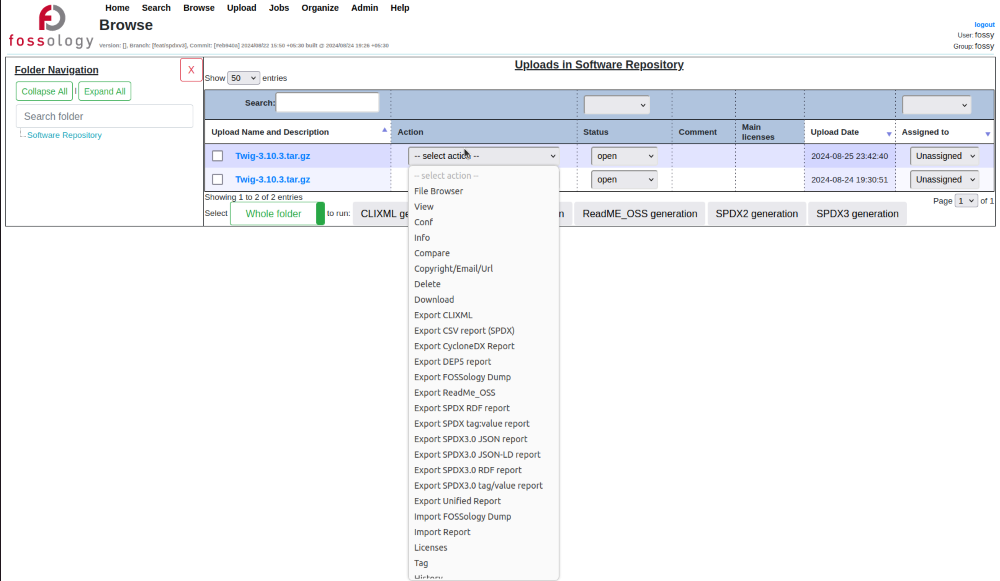

- The Show Jobs page will show the scheduled report generation task accordingly.
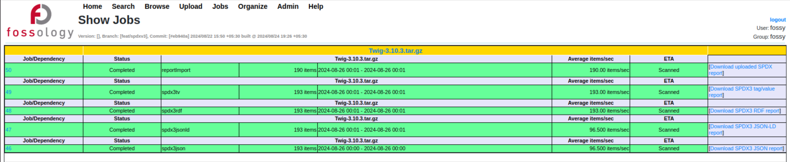

<h2>2. Support of SPDX v3.0 profiles</h2>

- Core profile
    - The Core profile describes the foundational classes and properties that are used by all profiles of the SPDX model.
- Software profile 
    - The Software profile contains information about files, packages, SBOMs, snippets, and artifacts of the software application.

Implemented the following use cases as required by the organization under Core and Software profile:
<h4>- Person</h4>
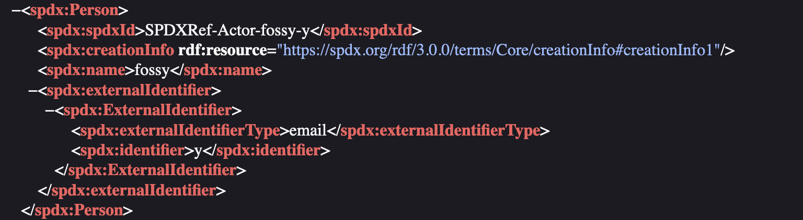
<h4>- Tool</h4>
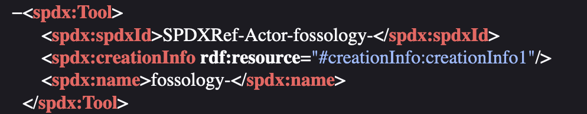
<h4>- File</h4>
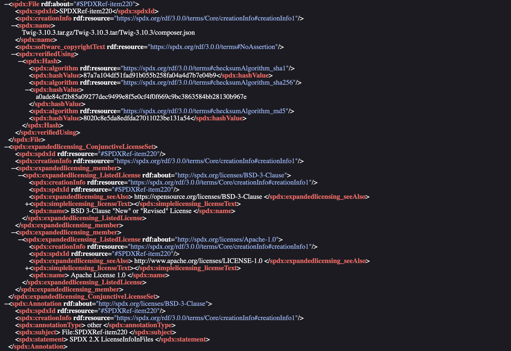
<h4>- Package</h4>
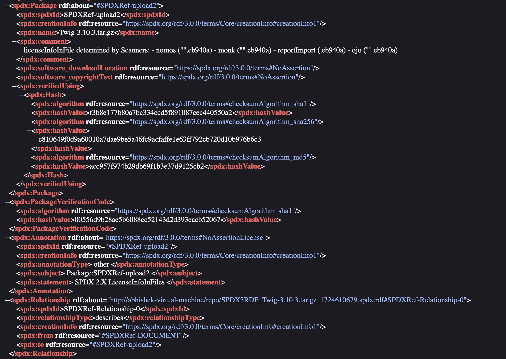
<h4>- Relationship with Package containing Files</h4>
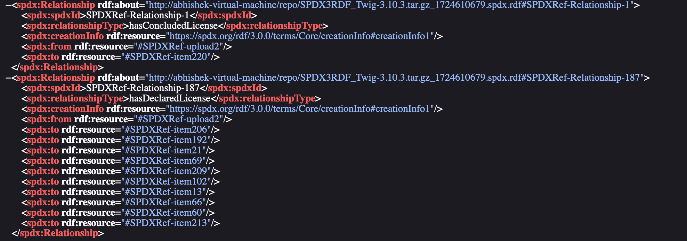
<h4>- SpdxDocument with Files</h4>
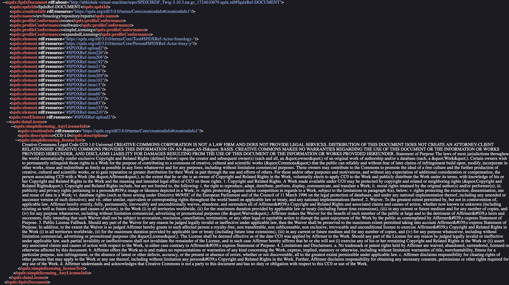

- Licensing profile
    - The Licensing profile describes the aspects of licensing for the software application under three categories (sub-directories) - Licensing, SimpleLicensing, and ExpandedLicensing. The Licensing category describes information about declared licenses and concluded (detected) licenses. The SimpleLicensing category describes information about text-formatted licenses. The ExpandedLicensing category describes information about parseable and machine-readable licenses.

Implemented the following use cases as required by the organization under Licensing profile:
<h4>- Simple Licensing Any License Info: For all licenses</h4>
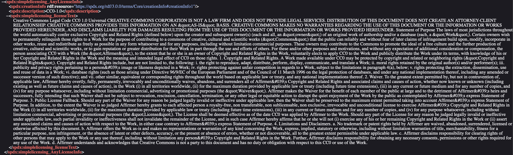
<h4>- Expanded Licensing Custom License: For Extracted License Info From File</h4>
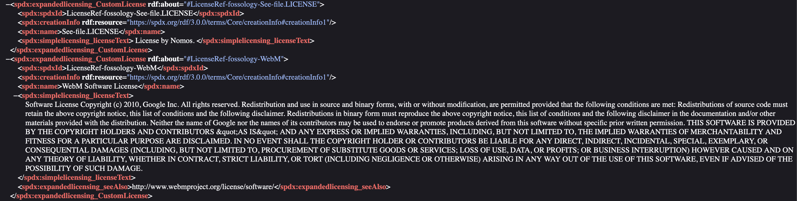
<h4>- Expanded Licensing Conjunctive and Disjunctive Licensing Set: For Dual Licenses</h4>

<h4>- Annotation: For LicenseInfoFromFile and for LicenseInfoInFile</h4>
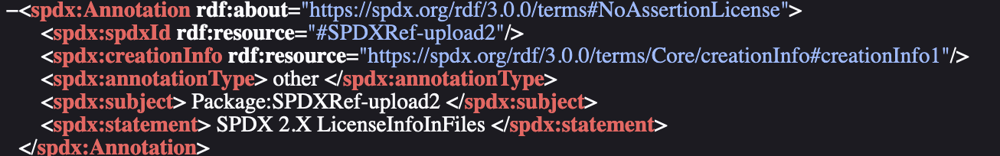

<h2>3. Support ingestion of SPDX v3.0 reports</h2>

The project also addressed the parsing of the SPDX v3.0 RDF reports. This was done using generating graph using php's EasyRDF package. Using the generated graph, the data was extracted and loaded to enable the seamless parsing of the SPDX v3.0 RDF report. In future, this can be extended to JSON and JSON-LD reports as well.

<h2>4. Integration of the codebases</h2>

The project also addressed the integrating SPDX v2.3 codebases with SPDX v3.0. The migration involved adapting existing functions from SPDX v2.3 to accommodate the new specifications introduced in SPDX v3.0, ensuring that the enhanced capabilities of SPDX v3.0 were seamlessly integrated without disrupting existing workflows.

<h1 align = "center" id = "documentation">📄 Documentation</h1>

Throughout the 12 weeks of the GSoC period, I consistently created weekly documentation to track and record my progress. Week-wise documentation can be found [here](https://fossology.github.io/gsoc/docs/2024/spdx30/).

<h1 align="center" id="deliverables">👨🏻‍🏫 Deliverables</h1>
  

## Project Tasks and Status

| **Tasks**                              | **Planned** | **Completed**           |
|----------------------------------------|-------------|-------------------------|
| **Report Generation in:**              |             |                         |
| - JSON-LD (with Core, Software, Licensing profile)  |     ✅      |     ✅                   |
| - JSON (with Core, Software, Licensing profile)     |     ✅      |     ✅                    |
| - RDF (with Core, Software, Licensing profile)      |     ✅      |     ✅                   |
| - tag:value (with Core, Software, Licensing profile)|     ✅      |     ✅                   |
| **Report Import Support**              |     ✅      |     ✅                   |
| **Integration with Codebase**          |     ❌       |     ✅                     |

 
 

<h1 align="center" id="key-takeaways">📚 Key Takeaways</h1>

- Gained valuable experience working with **large and legacy codebases**, boosting my confidence in navigating and contributing to complex projects.
- Developed strong skills in **remote collaboration**, effectively coordinating with a geographically dispersed team.
- Enhanced my **software design and problem-solving abilities** by tackling complex challenges and refining my technical approach.
- Mastered **time management**, consistently meeting project deadlines and ensuring successful, timely deliveries.
- Improved my ability to write **clean, maintainable code**, with a strong focus on best practices and code quality.
- Adapted to working with **multiple tech stacks and languages**, expanding my technical expertise and versatility.
- Grew my professional network and **made meaningful connections** along the way. 😊

<h1 align="center" id="work-done">🎯 Links of work done</h1>
<h2 >🔗 Pull Request</h2>

- [feat(spdx): Support SPDX v3.0 Reports](https://github.com/fossology/fossology/pull/2813)

<h1 align="center" id="acknowledgements">🎓 Acknowledgements</h1>

    Participating in FOSSology during Google Summer of Code has been an incredibly fulfilling experience, marking my first major step into the open-source community. This journey has imparted valuable lessons and created lasting memories that I will cherish throughout my career. While many individuals have played a role in my success, I would like to extend my deepest gratitude to a few who have been particularly influential.
     
     
    First and foremost, I wish to express my sincere thanks to my mentors, <a href="https://github.com/GMishx" target="_blank">Gaurav Mishra</a>, <a href="https://github.com/shaheemazmalmmd" target="_blank">Shaheem Azmal M MD</a> and <a href="https://github.com/sjha2048" target="_blank">Sahil Jha</a>, for their unwavering support, insightful guidance, and constant encouragement. Their expertise, patience, and willingness to help have been instrumental in my development, both professionally and personally. I am truly grateful for the opportunity to learn from them and for the mentorship they have provided.
     
     
   I also want to express my heartfelt gratitude to my family and friends for their unwavering support and encouragement throughout this journey. Their support has been a source of strength, and I am deeply thankful for the positive impact they have had on both my work and personal growth. Additionally, I have been fortunate to meet and collaborate with many talented developers from around the world during this experience. I look forward to future collaborations and the lasting friendships that have developed along the way.

<h1 align = "center" id = "connections">🌐 Let's connect! </h1>

-   
-   
-   
